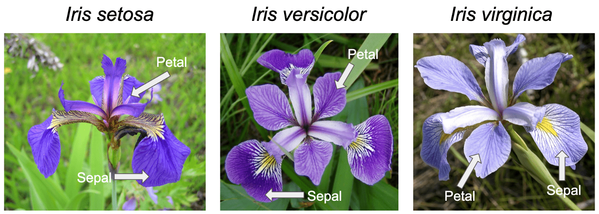

```{r setup, include=FALSE}
knitr::opts_chunk$set(echo = TRUE)
```

```{r libraries, include=FALSE}
library(tidyverse)
library(caret)
library(skimr)
library(Amelia)
library(ggsignif)
library(patchwork)
library(MLmetrics)
library(rattle)
```

```{r parameters, include=FALSE}
parent    = getwd()
data.path = file.path(parent, "data")
set.seed(12345)
```



## Abstract

**Background:** Iris dataset is a typical test case for many classification techniques. Our goal is to classify iris species using machine learning, this may be useful for ML learners, biologists or gardners. **Methods:** We performed EDA and MVA, then we splitted data and trained a rpart algorithm with k-fold cross-validation. **Results:** We obtained 0.96 balanced accuracy.

## About the data

The ***Iris*** **flower data set** or **Fisher's *Iris* data set** is a multivariate data set introduced by the British statistician and biologist Ronald Fisher in his 1936 paper *The use of multiple measurements in taxonomic problems* as an example of linear discriminant analysis. It is sometimes called **Anderson's *Iris* data set** because Edgar Anderson collected the data to quantify the morphologic variation of *Iris* flowers of three related species. Two of the three species were collected in the Gaspé Peninsula "all from the same pasture, and picked on the same day and measured at the same time by the same person with the same apparatus".

The data set consists of 50 samples from each of three species of *Iris* (*Iris setosa*, *Iris virginica* and *Iris versicolor*). Four features were measured from each sample: the length and the width of the sepals and petals, in centimeters. Based on the combination of these four features, Fisher developed a linear discriminant model to distinguish the species from each other.

```{r import, include=FALSE}
iris = iris
```

## Exploratory Data Analysis (EDA)

The first step is understanding the dataset structure. As expected, we have five columns and 150 rows. Our dependent variable is Species, which is also the only categorical column in the dataset. The other 3 variables are all numeric. Based on the number of observations in our dataset, we should decide if we want to split our dataset in two folds: a train set, used for training the ML models and a test set that should be used only for testing. Usually we don't split iris, but here we will do it just to demonstrate the method.

```{r glimpse}
glimpse(iris)
```

Our dependent variable (DV) is the *Species* variable, let's look at how it is composed.

### Check Dependent Variable

We can see that, as expected, the number of observations for each class in the dataset is 50. So we have a factor with 3 levels (setosa, versicolor, virginica) each one with 50 observations.

```{r check DV}
iris %>% group_by(Species) %>% tally()
```

### Missing Value Analysis (MVA)

Now we could ask ourselves if there are any missing values. The Missing Value Analysis is a fundamental step in EDA, as *NA* values must be dealt before modeling. Let's take a look.

```{r MVA}
missmap(iris)
```

No missing values were found. We can proceed with data splitting.

### Data splitting

Here we will split the data in two folds, a train (80%) and a test set (20%). we will inspect briefly the composition of the Dependent variable and then proceed to build descriptive stats for the train set.

```{r data splitting}
train_index = createDataPartition(y     = iris$Species,
                                  p     = 0.8,
                                  list  = FALSE,
                                  times = 1)

iris_train = iris[train_index,]
iris_test  = iris[-train_index,]

bind_rows(iris_train %>% 
            group_by(Species) %>%
            tally() %>%
            mutate(fold = "train"),
          iris_test %>%
            group_by(Species) %>% 
            tally() %>%
            mutate(fold = "test")) %>% 
  ggplot() +
  aes(x    = Species,
      y    = n,
      fill = fold) +
  geom_col(position = "dodge") +
  geom_text(aes(label = n),
            size     = 4,
            position = position_dodge(.9),
            vjust    = 1) +
  labs(title = "Data partition (DP)",
       subtitle = "The DP function created balanced partitions based on the DV.")
```

### Descriptive statistics

Let's visualize some descriptive information about our predictors. This is the tidyverse way, but it is a bit messy.

```{r descriptives stats with tidy}
summary_methods = list(min    = ~min(.x, na.rm  = TRUE),
                       max    = ~max(.x, na.rm  = TRUE),
                       mean   = ~mean(.x, na.rm = TRUE),
                       sd     = ~sd(.x, na.rm   = TRUE),
                       median = ~median(.x, na.rm = TRUE),
                       IQR    = ~IQR(.x, na.rm = TRUE))

iris_train %>% 
  group_by(Species) %>% 
  summarise(across(where(is.numeric), summary_methods))
```

Let's try again with skimr:

```{r descriptives stats with skim}
iris_train %>%
  group_by(Species) %>% 
  skim()
```

A bit confusing again. Let's try with some data visualization tool.

## Features association with DV

As we are using a categorical variable as DV and 4 numeric variables as predictors we should inspect the relationship between species and each feature in the dataset. We can use the box plot method coupled with some t-tests to display the statistical association between features while checking the predictors distributions.


We can inspect each variable one by one like we are doing in the next chunk.

```{r visualize only one feature}
iris_train %>% 
    ggplot() +
    aes(x = Species,
        y = Sepal.Length) +
    geom_boxplot() +
    geom_signif(comparisons = list(c("setosa", "versicolor"),
                                   c("versicolor", "virginica"),
                                   c("setosa", "virginica")),
                test = t.test,
                map_signif_level = c("***"=0.001, "**"=0.01, "*"=0.05),
                step_increase = .1) +
    labs(y = "Sepal Length")
```

Or build a for loop, coupled with patchwork, to display all of them in a single shot. Please note that we increased the plot size in the chunk options.

```{r viz stats with a for loop, fig.width = 8, fig.height= 8}
predictors = names(iris_train)[1:4]

plot.list  = vector(mode = "list", length = length(predictors))

for (i in 1:length(predictors)) {
  plot.list[[i]] = iris_train %>% 
    ggplot() +
    aes(x = Species,
        y = .data[[predictors[[i]] ]]) +
    geom_boxplot() +
    geom_signif(comparisons = list(c("setosa", "versicolor"),
                                   c("versicolor", "virginica"),
                                   c("setosa", "virginica")),
                test = t.test,
                map_signif_level = c("***"=0.001, "**"=0.01, "*"=0.05),
                step_increase = .05) +
    labs(y = str_replace(predictors[[i]], "\\.", " "))
}

plot.list[[1]] + plot.list[[2]] + plot.list[[3]] + plot.list[[4]] +
  plot_layout() +
  plot_annotation(tag_levels = "A")
```

Looking at this plots we can see that all the features have some potential to discriminate between iris classes, and they all report p.value \< 0.05. Now we need to preprocess data and build a model.

## Data preprocessing

Here we use a standard preprocessing procedure called center and scale. The center method subtracts the mean of the predictor's data from the predictor values, while scale divides the values by the standard deviation. You should perform preprocessing on train set, then apply the transformer object both on train and test set to avoid data leakeage.

```{r preprocessing}
std.prep = preProcess(x      = iris_train,
                      method = c("center", "scale"))

iris_train_prep = predict(object = std.prep, iris_train)
iris_test_prep  = predict(object = std.prep, iris_test)
```

## Model tuning

Our first step is to define a Cross- Validation strategy. Here we will use a k-fold cross-validation. This is not optimal for low sample sizes (you should use Leave One Out Cross-validation) but we are doing it only as a demonstration of the most common CV strategy.

```{r define cls control}
# Ten-k fold (repeated 5 times; so 50 resamples in total)
cls.ctrl = trainControl(method          = "repeatedcv", 
                        number          = 10,
                        repeats         = 5,
                        classProbs      = TRUE, 
                        summaryFunction = multiClassSummary,
                        savePredictions = "final", 
                        sampling        = NULL,
                        search          = "random",
                        seeds           = NULL,
                        allowParallel   = TRUE)
```

## Model fitting

We will fit a Random Forest. This may not be the best choice, if you are interested in learning more about model selection you should google "No free lunch theorem".

```{r fit a random forest, message=FALSE, warning=FALSE}
fit = train(Species ~.,
            data      = iris_train_prep,
            method    = "rpart",
            trControl = cls.ctrl)

fit$results %>% 
  relocate(Mean_Balanced_Accuracy, .after = "cp")
```

Our results says that on average, we obtained 0.96 Accuracy in discriminating iris species. In the next chunk we will see the confusion matrix on cross validation. For example, 4 subjects of virginica tend to be missclassified in versicolor. 

```{r CV on cross-validation}
confusionMatrix(fit)
```

Here we will check if our model is able to generalize to unseen data. As we can see the accuracy is not dropping, thus or model can be considered stable. 

```{r CV on test set}
predictions = predict(object = fit, iris_test_prep)

confusionMatrix(data = predictions, reference = iris_test$Species, mode = "everything")
```
Let's take a look to the rpart model with the cut off points for the selected variables. 

```{r Visualize the rpart}
fancyRpartPlot(fit$finalModel, type = 5, caption = "")
```

